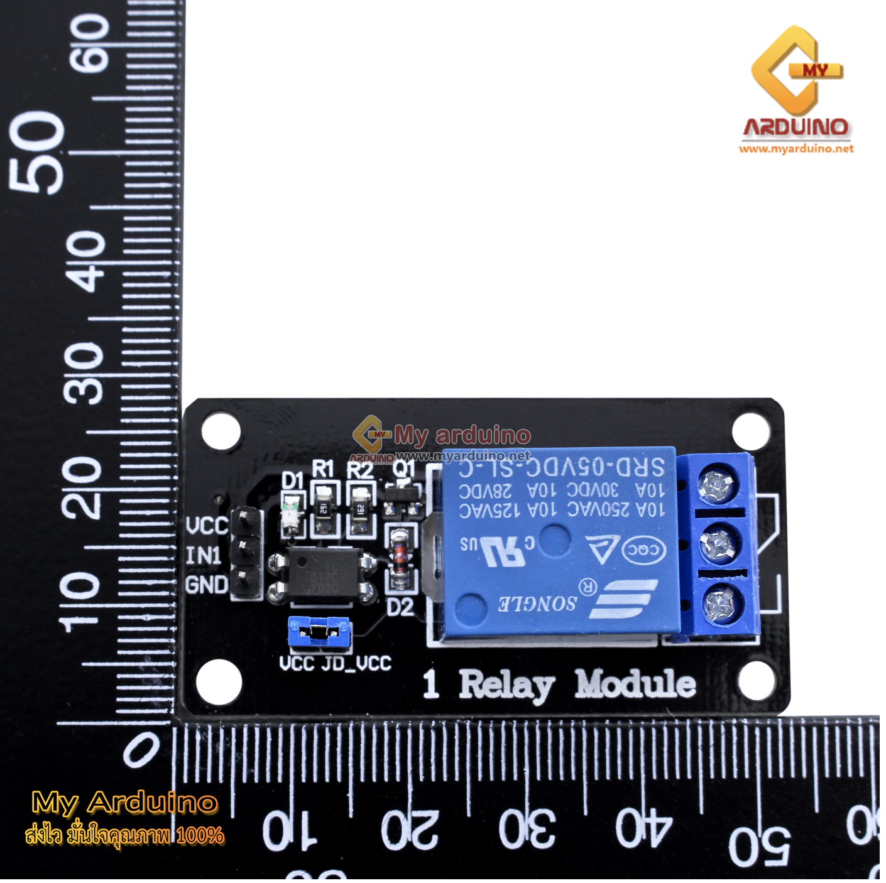
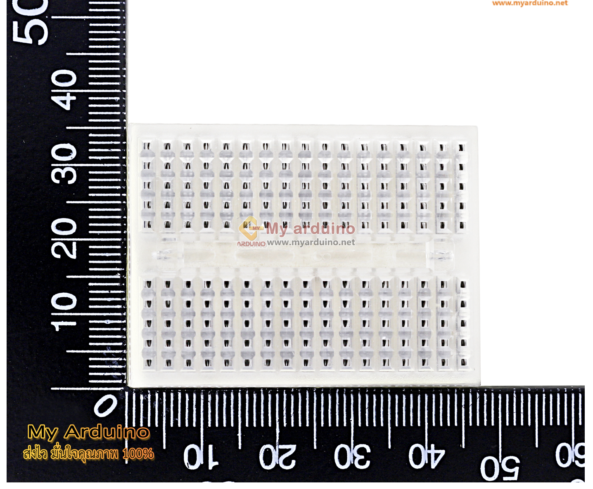
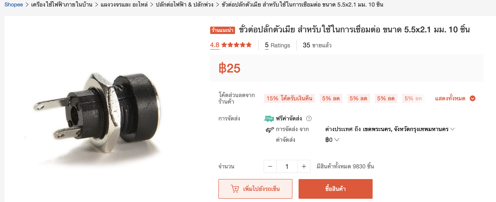
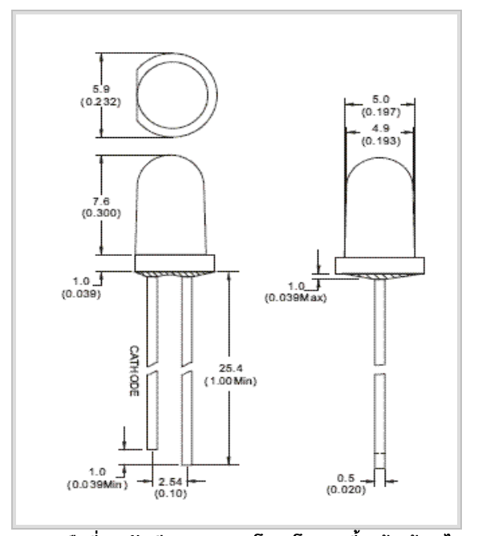
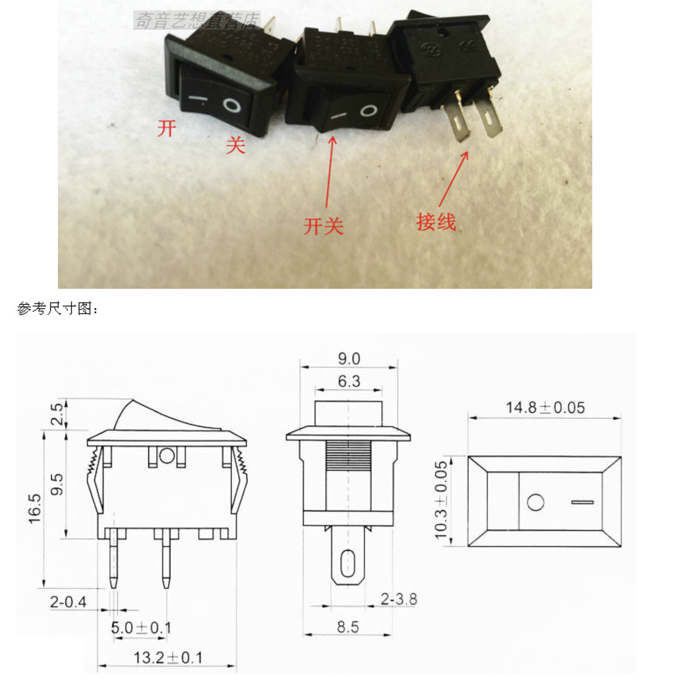
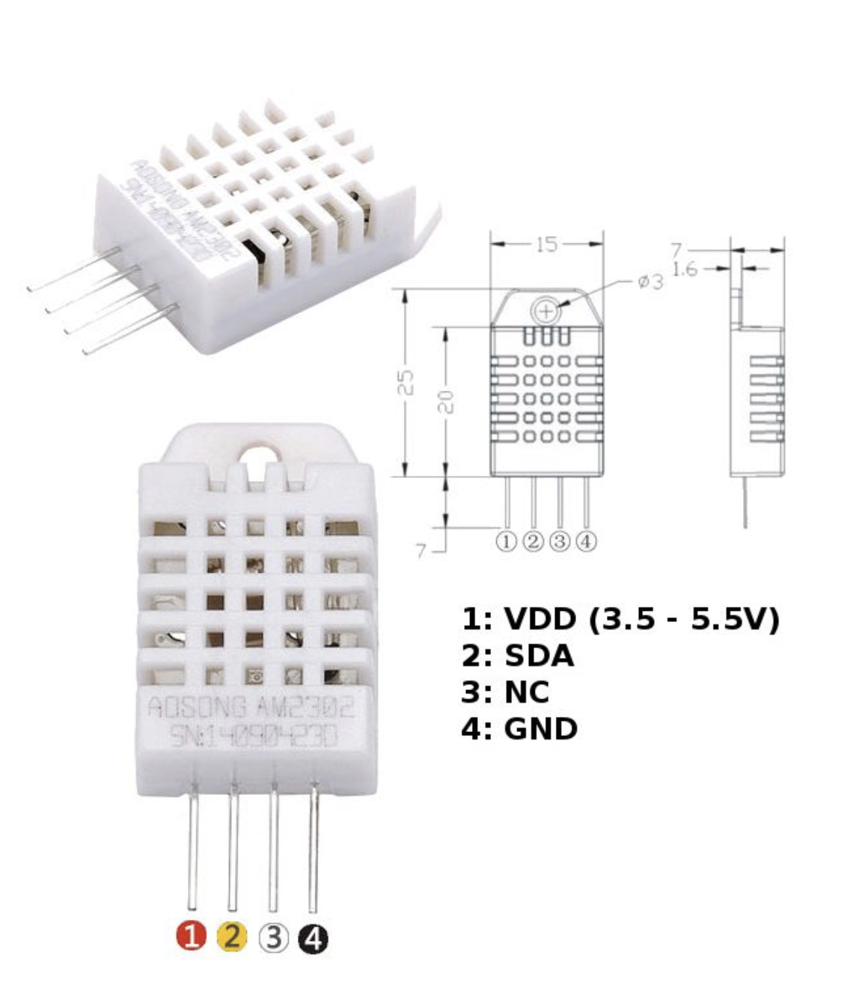

# Temp_box

-------------------CPE405(T) WEEK1-LAB001-------------------
Hi, everyone 

This project build for education  on Bachelor's degree

         - - - - - - - - - - - - - - 
        | CPE405(T)                 |
         - - - - - - - - - - - - - - 
        | Parkin Thanantthanachon   |
         - - - - - - - - - - - - - - 
        | 61043845                  |
         - - - - - - - - - - - - - - 

        *********************************
        Software : Freecad              *
        Project : Temp box 
        Date    : 6/09/2021

        equipment : 
                        1. NodeMCU ESP8266 V2   X1
                        2. Relay 5 V 1 CH       X1
                        3. Breadboard 170 hole  X1
                        4. connector 5mm. 2     X2
                        5. LED 3 v              X1
                        6. Switch 2 way nc,no   X1
                        7. DHT22                X1

        ----------------------------------------------------------------------------
        | this project have  3 Section fusionm file must build on Freecad Software |
        |                -----------------------------------------------------------
        | 1. lid-box     |
        | 2. mainboard   |
        | 3. margin-box  |
        ------------------
                | | 
                \ /
                 v
        list : {
            lid-box : {
                    lidbox,                         
                    lid_layer1                      
                        }
            mainboard :{
                    lock-nut-wall-top,              
                    lock-nut-wall-down              
                         mainboard_bot :{
                                 margin-breadboard  : {
                                         t_l,
                                         t_r,
                                         b_l,
                                         b_r
                                 }
                                 main-nut  : {
                                         bottom_mainboard,
                                         breadboard,
                                         nut_left_relay,
                                         nut_right_relay
                                 } 
                        }
                }
             margin-box : {
                    top,
                    bot,
                    right,
                    left,
                    lock-nut-left,
                    lock-nut-right      
                          }
                                    }
               }
****************************************************************************
        lid-box :{
                width  : 110 mm.
                height : 70  mm.
        },
        lid-layer1 :{
                width  : 110 mm.
                height : 70  mm.
        }, 
****************************************************************************
        lock-wall-top : {
                        width  : 15 mm,
                        height : 25 mm
                        circle(drill) : { 
                                radius :  1.5 mm,
                                height form point : 3.5 mm,
                                width from point : 7.5 mm
                                }
                        }
                }, 
                lock--wall-bot : {
                        width  : 15 mm,
                        height :  25 mm
                        circle(drill) : { 
                                radius :  1.5 mm,
                                height form point : 21.5 mm,
                                width from point : 7.5 mm
                                }
                },
                        mainboard_bot :{
                                    margin-breadboard(all={top,right,left,bot}) : {
                                        width  : 1.5 mm, (4 piece)
                                        height : 7 mm   (4 piece)
                                                main-nut : {
                                                        bottom_mainboard :{
                                                                width  :  110 mm,
                                                                height :  70 mm
                                                        }
                                                        breadboard : {
                                                                width  : 31 mm,
                                                                height : 47 mm
                                                        }
                                                        nut-left-relay :{
                                                                radius : 1.5 mm, (in)
                                                                radius : 2.5 mm (out)
                                                        }
                                                        nut-right-relay :{
                                                                radius : 1.5 mm. (in)
                                                                radius : 2.5 mm (out)
                                                        }
                                                }
                                 }
                        }    
****************************************************************************
        margin-top :{
                width  : 70  mm,
                height : 36  mm
                },
        margin-bot :{
                width  : 70  mm,
                height : 36  mm
                },
        margin-left :{
                width  : 70  mm,
                height : 36  mm
                },
        margin-right :{
                width  : 70  mm,
                height : 36  mm
                }
        left-nut :{
                radius : 1.5 mm,
                height form point : 10 mm,
                width from point  : 10 mm
        }
        right-nut :{
                radius : 1.5 mm,
                height form point : 10 mm,
                width from point  : 10 mm
        }

****************************************************************************

****************************************************************************

        list of references : 

1. NodeMCU ESP8266 V2   

2. Relay 5 V 1 CH      

3. Breadboard 170 hole  

4. connector 5mm. 2     

5. LED 3 v            

6. Switch 2 way nc,no  

7. DHT22            

