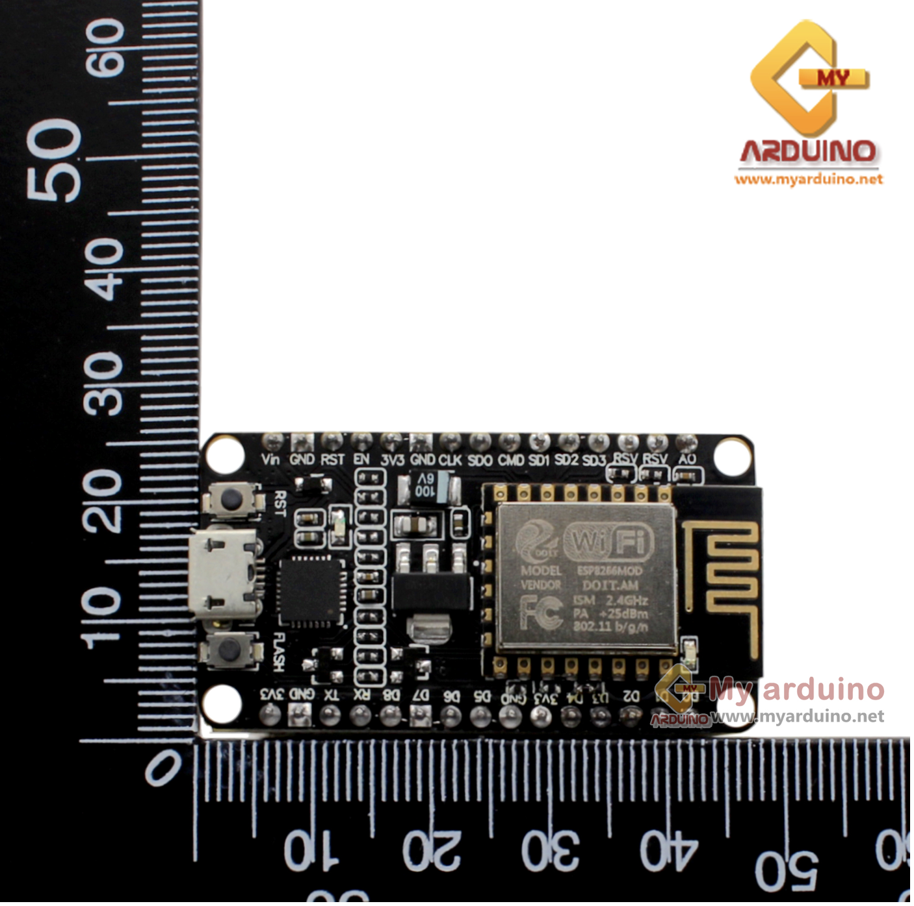

# Temp_box

-------------------CPE405(T) WEEK1-LAB001-------------------

         - - - - - - - - - - - - - - 
        | CPE405(T)                 |
         - - - - - - - - - - - - - - 
        | Parkin Thanantthanachon   |
         - - - - - - - - - - - - - - 
        | 61043845                  |
         - - - - - - - - - - - - - - 

        *********************************
        Software : Freecad              *
        Project : Temp box 
        Date    : 6/09/2021

        equipment : 
                        1. NodeMCU ESP8266 V2   X1
                        2. Relay 5 V 1 CH       X1
                        3. Breadboard 170 hole  X1
                        4. connector 5mm. 2     X2
                        5. LED 3 v              X1
                        6. Switch 2 way nc,no   X1
                        7. DHT22                X1

        ----------------------------------------------------------------------------
        | this project have  3 Section fusionm file must build on Freecad Software |
        |                -----------------------------------------------------------
        | 1. lid-box     |
        | 2. mainboard   |
        | 3. margin-box  |
        ------------------
                | | 
                \ /
                 v
        list : {
            lid-box : {
                    lidbox,
                    lid_layer1
                        }
            mainboard :{
                    lock-nut-wall-top,
                    lock-nut-wall-down
                         mainboard_bot :{
                                 margin-breadboard,
                                 main-lock-nut
                                        }
                         }
             margin-box : {
                    top,
                    bot,
                    right,
                    left,
                    lock-nut-left,
                    lock-nut-right
                          }

                                    }
               }

****************************************************************************

        list of references : 

1. NodeMCU ESP8266 V2   

2. Relay 5 V 1 CH      

3. Breadboard 170 hole  

4. connector 5mm. 2     

5. LED 3 v            

6. Switch 2 way nc,no  

7. DHT22            

